# TinyEXR vs OpenEXR — performance

How the pure-C11 TinyEXR v3 codec stacks up against the reference **OpenEXR**
library, codec by codec, for encode and decode — single-threaded and
multi-threaded.

> **Setup & method**
> - **CPU:** AMD Ryzen 9 3950X (16C/32T, Zen2), `avx2+f16c`. Machine idle.
> - **Image:** `asakusa.exr`, 660×440, 4× HALF. (Small — see the caveat in
>   [Multi-threading](#multi-threading) about chunk-count-limited scaling.)
> - **I/O:** fully in memory (`StdOSStream`/`StdISStream` on the OpenEXR side);
>   each library loads the same source independently. OpenEXR 4.0-dev, `gcc -O3`.
> - Throughput is **megapixels/second** (higher is better); sizes are the
>   compressed payload. Numbers vary a few % run-to-run.
> - Both libraries are pinned to the same thread count
>   (`Imf::setGlobalThreadCount(n)` / `exr_set_num_threads(n)`).

## TL;DR

- **Single-thread decode:** TinyEXR wins big on the cheap codecs — **3.5×** on
  uncompressed and **2.5×** on RLE. On the DEFLATE family / PIZ, OpenEXR leads
  (≈1.2× ZIP, ≈1.8× PXR24, ≈2.1× ZIPS) because of its **libdeflate** backend;
  the new PIZ Huffman path is effectively tied (33.8 vs 35.6 MP/s).
  HTJ2K is also closer in the Ryzen/AVX2 build path.
- **Single-thread encode:** TinyEXR ties or wins on RLE/PIZ/B44; OpenEXR is
  ≈1.5× on ZIP/ZIPS, ≈1.8× on PXR24, and ≈3× on HTJ2K.
- **libdeflate (default on hosted, `DEFLATE=auto`):** with the same backend
  TinyEXR **matches or beats** OpenEXR on the deflate family — e.g. **ZIP decode
  1.4×** single-thread — and beats its own in-tree codec by **+55–73%** on
  natural images. Runtime-switchable via `exr_zlib_set_backend()`.
- **Multi-threaded:** TinyEXR's opt-in parallel path scales ~5–9× to 16 threads;
  at 16T it **out-decodes OpenEXR on RLE/ZIP/ZIPS/B44** (in-tree), and with
  libdeflate it leads the whole deflate family by a wide margin.

## Single thread

### Decode

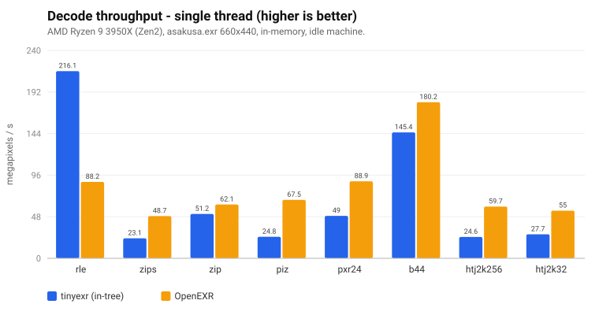

`none` (uncompressed) is off the chart on purpose: **TinyEXR 1384 vs OpenEXR
392 MP/s** (~3.5×) — no thread-pool or framebuffer-copy overhead. TinyEXR also
leads **RLE** (115 vs 47, ~2.5×). With the hosted/libdeflate build, OpenEXR is
ahead on ZIP/ZIPS and PXR24, while the new PIZ path is effectively tied:
**33.8 vs 35.6 MP/s**. A TinyEXR ZIP-decode profile is still dominated by
inflate; the predictor and de-interleave passes are already vectorized.

### Encode

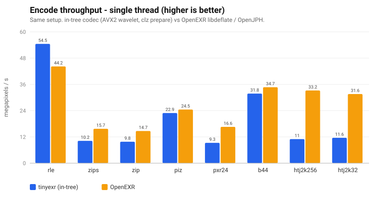

TinyEXR ties or beats OpenEXR on **RLE / PIZ / B44**. On **ZIP/ZIPS** it is ~1.5×
behind and **PXR24** ~1.8× — its in-tree, dependency-free LZ77 encoder is fast
but not libdeflate-level. **HTJ2K** encode is the widest gap (~3×: the separate
JPH/OpenJPH encoder). TinyEXR's HTJ2K paths recently gained an AVX2 forward 5/3
wavelet, an unstuffed-buffer entropy reader, and a `clz`-builtin fast path in the
per-sample prepare (encode +~39%, decode +~18% vs the pre-SIMD baseline). The
decode path then restructured the inverse 5/3 **column** pass into a
column-parallel, gather/scatter-free AVX2 vertical lifting (mirroring OpenJPH —
columns are the natural SIMD axis), and vectorized the sign-magnitude → signed
coefficient extraction; together these cut decode wavelet+extraction time
materially (~16% faster all-HALF decode on the dev box). The same
column-parallel restructuring was then applied to the **forward** 5/3 (encode,
byte-identical output, ~7% faster htj2k256 encode) and to the **int64** inverse
5/3 used for float/32-bit channels (AVX2 1D + vertical, ~18% faster float
decode). The cleanup-pass entropy decoder was then moved to an OpenJPH-style
rolling forward MagSgn reader, with AVX2 cleanup kernels for the common 16/32-bit
HT block paths; decode workspace reuse removed repeated scratch allocation; and
the all-HALF inverse 5/3 postprocess gained a bounded AVX2 vertical pass. On
this Zen2 machine, current `make bench` reports HTJ2K256 decode at **45.2 MP/s**
and HTJ2K32 decode at **43.1 MP/s**; the latest available same-machine OpenJPH
baseline is **58.8 / 56.2 MP/s**, so TinyEXR is ~77% of OpenJPH throughput
(~1.30× gap). The remaining gap is mostly entropy/block decode latency.

### Compression size

Sizes are essentially identical for the lossless/standard codecs — the formats
are interoperable (a TinyEXR file decodes in OpenEXR and vice-versa). Only ZIP
and HTJ2K differ, from encoder *tuning* (not format):

| codec | TinyEXR KB | OpenEXR KB | | codec | TinyEXR KB | OpenEXR KB |
|---|--:|--:|---|---|--:|--:|
| none | 2276 | 2276 | | pxr24 | 1158 | 1163 |
| rle  | 1644 | 1644 | | b44   |  993 |  993 |
| zips | 1205 | 1212 | | htj2k256 | 1132 | 1016 |
| zip  | 1155 | 1070 | | htj2k32  | 1160 | 1042 |
| piz  |  742 |  742 | | | | |

### The libdeflate backend (default on hosted)

OpenEXR's deflate speed comes from libdeflate. TinyEXR vendors **libdeflate 1.25**
(MIT) for ZIP/ZIPS/PXR24 and, as of `DEFLATE=auto`, makes it the **default on
hosted builds**. Both codecs are linked; pick at runtime with the public
`exr_zlib_set_backend()`. The in-tree pure-C codec remains the default for
`DEFLATE=intree` and the only path for freestanding/WASM.

```sh
make bench-compare                  # DEFLATE=auto (libdeflate, level 4 = OpenEXR)
make bench-compare DEFLATE=intree   # in-tree pure-C codec
```

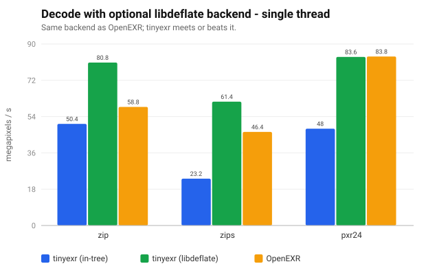

Same backend ⇒ byte-identical sizes, and TinyEXR **meets or beats** OpenEXR:
**ZIP decode 80.8 vs 58.8 MP/s (1.37×)**, ZIPS 61.4 vs 46.4 (1.32×), PXR24 at
parity. Encode reaches parity too (ZIP 15.3 vs 14.0, PXR24 16.4 vs 15.8). Both
call libdeflate's inflate; TinyEXR's edge is its SSE2/AVX2 predictor and lower
per-block overhead.

**Why it's the default.** Over the in-tree codec the lift is large on natural
photographic data: on the `openexr-images` corpus, decode rises **ZIP 226→391
(+73%), ZIPS 171→278 (+63%), PXR24 309→479 (+55%) Mpix/s**. The gap is
data-dependent — the in-tree inflate is *symbol-decode-bound* and trails
libdeflate on high-entropy natural images, but on smooth, highly-compressible
data (long LZ matches; e.g. the ALab 4K texture pack) it is *copy-bound* and
actually edges libdeflate by ~8%. libdeflate is the safer default for the
diverse real-world case; the in-tree codec stays best for tiny/freestanding
builds.

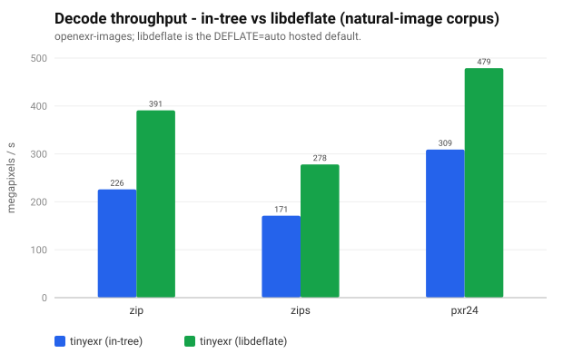

*(`doc/gen_perf_charts.py` regenerates the data-bearing SVGs, including the
README chart; run `convert -background white doc/perf-libdeflate-htj2k-decode.svg
doc/perf-libdeflate-htj2k-decode.png` to refresh its PNG.)*

**PIZ decode** now uses an OpenEXR-style two-window Huffman reader: a 12-bit
short-code table, canonical base/offset lookup for long codes, and a reusable
symbol-ID table. It retains the original bounded reader as a correctness
fallback. On the Ryzen 9 3950X snapshot this brings PIZ decode to **33.8 MP/s
vs OpenEXR 35.6 MP/s** on `asakusa.exr`, while preserving identical 742 KB
output and passing the streaming/regression corpus.

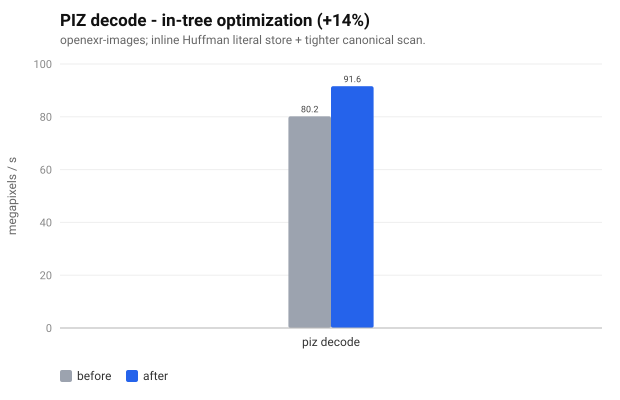

**ZSTD** decode (vendored upstream, already SIMD-dispatched) runs ~**410–420
Mpix/s** here — faster than the libdeflate ZIP path on identical content; there
is no second zstd backend to dispatch against.

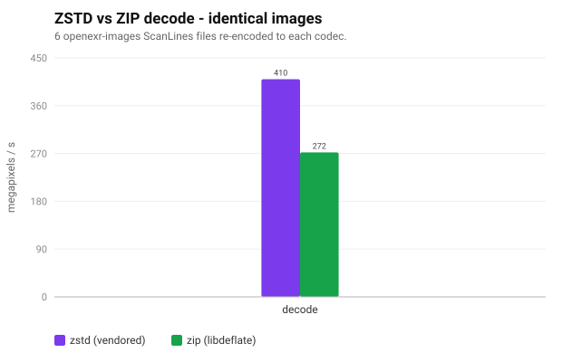

The two charts below put **libdeflate on/off vs OpenEXR** side by side across the
deflate family **and HTJ2K** (which has no deflate path, so only the in-tree and
OpenEXR bars apply). The in-tree TinyEXR bars are the `DEFLATE=intree` /
freestanding codec; the green bars are the `DEFLATE=auto` (libdeflate) default:

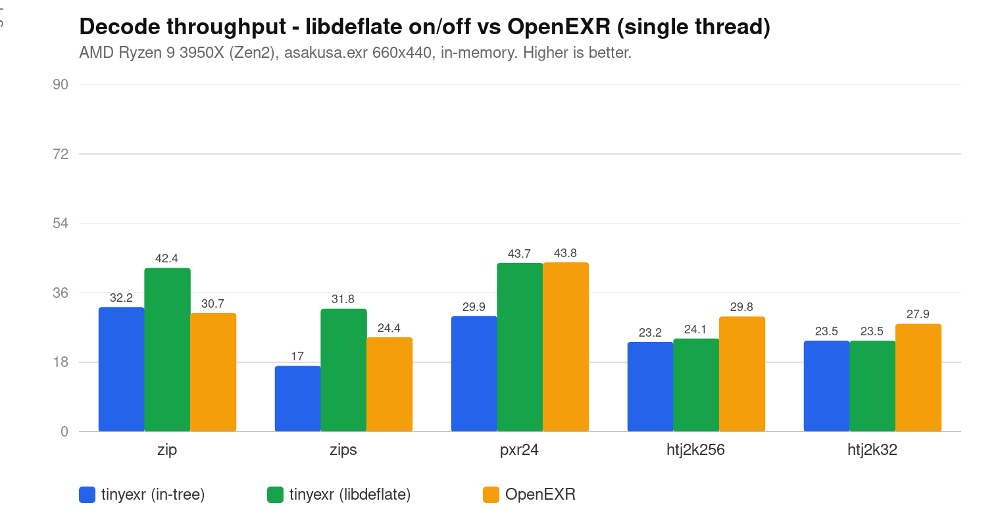

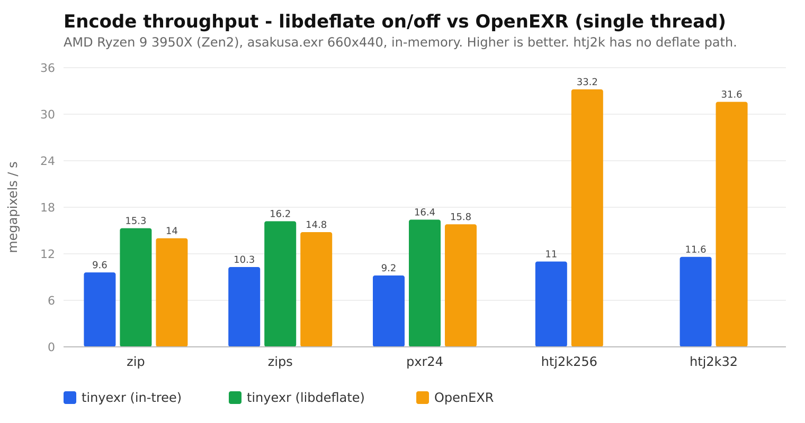

On decode, libdeflate flips the deflate family in TinyEXR's favour (ZIP/ZIPS) and
brings PXR24 to parity; HTJ2K stays OpenEXR's (its tuned JPH decoder). On encode,
libdeflate lifts the deflate family to parity-or-better, while OpenEXR keeps a
wide HTJ2K lead from its SIMD JPH entropy encoder.

### Full single-thread numbers

Hosted default (`DEFLATE=auto`, `V3_OPT=-O3`), refreshed on 2026-08-08:

| codec | tx enc | exr enc | tx dec | exr dec |
|-------|-------:|--------:|-------:|--------:|
| none  | 50.6 | 41.9 | 1380 | 389 |
| rle   | 30.5 | 22.5 | 114  | 45.5 |
| zips  | 8.5  | 7.8  | 31.8 | 24.4 |
| zip   | 7.9  | 7.5  | 42.4 | 30.7 |
| piz   | 12.8 | 12.8 | 33.8 | 35.6 |
| pxr24 | 8.5  | 8.2  | 43.7 | 43.8 |
| b44   | 18.1 | 17.4 | 102  | 86.8 |
| htj2k256 | 18.7 | 16.4 | 24.1 | 29.8* |
| htj2k32  | 17.2 | 15.6 | 23.5 | 27.9* |

`*` HTJ2K OpenEXR/OpenJPH values are the latest available same-machine baseline;
that OpenJPH build has the default x86 SIMD path enabled and selects its AVX2
codeblock decoder on this CPU. The TinyEXR HTJ2K values above were re-measured
on 2026-06-13 with `make bench`.

`LIBDEFLATE=1` (deflate family): zip 15.3/14.0/80.8/58.8, zips 16.2/14.8/61.4/46.4,
pxr24 16.4/15.8/83.6/83.8 (tx enc / exr enc / tx dec / exr dec).

## Multi-threading

TinyEXR supports **per-block parallel encode and decode** via portable C11
`<threads.h>` (or **Grand Central Dispatch** on Apple platforms, which do not
ship `<threads.h>`) and a small ephemeral worker pool. It is **opt-in** (build
`THREADS=1` / `-DEXR_USE_THREADS`; default and freestanding builds stay
single-threaded); the count is set at runtime:

```c
exr_set_num_threads(16);   /* 0/1 = serial (default) */
```

It covers scanline and single-level tiled parts, the deep scanline/tiled
encode and decode paths, and mipmap/ripmap level generation (the box downsample
is row-parallel) on the in-memory load/save paths; the streaming APIs remain
single-threaded. Encode stays byte-deterministic and decode bit-identical
regardless of thread count (unit-tested, ThreadSanitizer-clean).

### Scaling

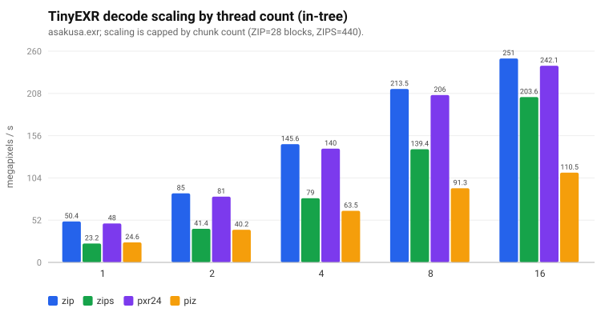

TinyEXR decode scales **~5× (ZIP, 28 blocks)** to **~8.8× (ZIPS, 440 blocks)** at
16 threads. Scaling is bounded by the number of chunks: `asakusa.exr` is small,
so ZIP (16 lines/block ⇒ 28 blocks) saturates earlier than ZIPS (1 line/block ⇒
440 blocks). Larger images would scale further. (`none` decode does *not* benefit
— it is memory-bound with no per-block work, so thread overhead dominates.)

### TinyEXR vs OpenEXR at 16 threads


Both libraries at `EXR_THREADS=16`, in-tree TinyEXR build. TinyEXR out-decodes
OpenEXR on **RLE (456 vs 150), ZIP (251 vs 226), ZIPS (204 vs 174), B44 (362 vs
319)**; OpenEXR still leads **PIZ (208 vs 110)** and edges **PXR24 (270 vs 242)**.

With **`LIBDEFLATE=1` at 16 threads** TinyEXR leads the deflate family decisively:

| codec | tx dec | exr dec | | tx enc | exr enc |
|-------|-------:|--------:|---|-------:|--------:|
| zip   | **339.6** | 226.6 | | **102.3** | 88.0 |
| zips  | **358.5** | 151.1 | | **153.1** | 82.2 |
| pxr24 | **341.7** | 285.0 | | **105.7** | 96.9 |

(MP/s. OpenEXR's own per-block scaling is included — this is a like-for-like
16-thread comparison.)

Reproduce:

```sh
make bench-compare THREADS=1                         # single thread (default)
EXR_THREADS=16 ./build/bench_compare                 # 16 threads, both libs
make bench-compare THREADS=1 LIBDEFLATE=1            # + libdeflate backend
```

## GPU offload (CUDA backend)

> **Setup & method**
> - **GPU:** NVIDIA GeForce RTX 5060 Ti; **CPU:** same Ryzen 9 3950X as above.
> - **Path:** the optional CUDA backend (`make CUDA=1`, runtime-loaded via cuew +
>   NVRTC). Whole-image `exr_gpu_load_from_memory` / `exr_gpu_save_to_memory` vs
>   the CPU `exr_load_from_memory` / `exr_save_to_memory`, fully in memory.
> - **What runs on GPU:** the *parallel* reconstruction passes — predictor +
>   even/odd deinterleave (ZIP/ZIPS/RLE), channel split, half↔float — plus the
>   HTJ2K **HT block coder** (one thread per 128×32 code-block, bit-exact). The
>   **bit-serial entropy stages stay on the CPU by necessity**: DEFLATE inflate
>   (ZIP/ZIPS/PXR24), zstd, RLE expand, PIZ Huffman+wavelet, and the HTJ2K
>   transform/packet assembly. So every block pays a CPU↔GPU round-trip around an
>   inherently serial core.
> - Output is bit-identical / pixel-identical to the CPU path; the GPU path falls
>   back to CPU for deep parts and unsupported cases.
> - Throughput is **MP/s** (higher is better); one-time NVRTC compile and lazy
>   device-buffer init are warmed up and excluded. `make bench-gpu-jph`.

**Headline: the hybrid GPU path is correctness-complete but does *not* beat CPU.**
Only `htj2k256` decode edges above parity, and only on large images. This is a
real, measured property of the design, not a tuning gap — see the analysis below.

Whole-image throughput, large image (synthetic 4096², 4× HALF, 16.78 MP — the
best case for the GPU, where there are the most blocks to amortize the launch):

| codec | dec CPU | dec GPU | dec ratio | enc CPU | enc GPU | enc ratio |
|-------|--------:|--------:|:---------:|--------:|--------:|:---------:|
| none     | 189.3 |  70.8 | 0.37× |  76.8 |  57.4 | 0.75× |
| rle      | 137.0 |  15.8 | 0.12× |  93.9 |  63.5 | 0.68× |
| zips     | 100.6 |  15.1 | 0.15× |  59.9 |  45.2 | 0.75× |
| zip      | 139.4 |  93.2 | 0.67× |  60.1 |  52.1 | 0.87× |
| piz      |  31.5 |  29.3 | 0.93× |  34.7 |  34.5 | 0.99× |
| pxr24    | 131.7 | 102.3 | 0.78× |  66.1 |  58.6 | 0.89× |
| b44      |  76.5 |  65.8 | 0.86× |  50.8 |  45.8 | 0.90× |
| zstd     | 209.8 | 151.9 | 0.72× | 565.6 | 246.6 | 0.44× |
| htj2k256 |  33.2 | **36.9** | **1.11×** |  30.8 |  19.4 | 0.63× |
| htj2k32  |  39.0 |  35.5 | 0.91× |  31.1 |  30.2 | 0.97× |

(MP/s. On the small `asakusa` (0.29 MP) every ratio is *worse* — e.g. `none`
decode 2437 → 19 MP/s (0.01×), `rle` decode 0.01×, `htj2k256` decode 0.80× — the
launch + H2D/D2H overhead dwarfs the per-block work when there are few blocks.)

Why the GPU loses despite a 200+ GB/s card, codec by codec:

- **`none` / `rle` decode collapse (0.01–0.37×).** The CPU path here is essentially
  a `memcpy` + deinterleave at 130–2400 MP/s; there is no compute to offload, so a
  device round-trip is pure loss. These codecs should always stay on CPU.
- **DEFLATE family (zip/zips/pxr24) and zstd reach 0.4–0.9×.** The entropy decode
  (inflate / zstd) is bit-serial and *cannot* move to the GPU; the GPU only takes
  the predictor + deinterleave + channel-split passes — which are already SSE2/AVX2
  vectorized and memory-bandwidth-bound on the CPU. The H2D/D2H copy costs more
  than those cheap passes save, so it nets out below 1.0×.
- **PIZ ≈ parity (0.93–0.99×).** PIZ reconstruction is entirely CPU (the GPU does
  only channel split + widen), so the GPU path is "CPU work + a near-free
  round-trip" ⇒ parity, never a win.
- **HTJ2K is the only genuinely GPU-amenable codec** — its HT block coder is heavy
  *and* embarrassingly parallel across code-blocks. `htj2k256` decode crosses to
  **1.11×** at 16.8 MP. Encode stays behind (0.63×): the block coder is only ~37 %
  of encode time ([the serial MagSgn floor](htj2k-encode-bottleneck.md)), and the
  GPU gain on that slice doesn't pay for the round-trip plus the still-CPU
  transform + bitstream assembly.

**Takeaway.** With the entropy stage pinned to the CPU and the reconstruction
passes already cheap there, single-image hybrid offload is round-trip-bound and
at best reaches parity. The GPU backend earns its keep in two places it is *not*
penalised by the round-trip: (1) **HTJ2K large-image decode**, the one codec heavy
enough to win; and (2) **chained processing** (resize / color / tonemap / transfer
/ LUT) where the image stays resident on-device across many ops and the per-call
copy amortizes. A whole-pipeline HTJ2K win additionally needs the transforms moved
on-device ([GPU transform kernels](htj2k-gpu-port.md), a deferred follow-up) to
remove the per-image coefficient copy.

Reproduce (all codecs, CPU vs GPU):

```sh
make bench-gpu-jph                                   # asakusa (0.29 MP)
EXR_BENCH_IMG=path/to/img.exr make bench-gpu-jph     # any image
./build/bench_gpu_jph synth:4096x4096                # synthetic NxN probe
```

## ARM64 / NEON (Apple Silicon)

The same comparison on **Apple M1** (4 P-core + 4 E-core, macOS 26, Apple
clang 21), `asakusa.exr`. TinyEXR's codec auto-dispatches to **NEON**; threading
uses **Grand Central Dispatch** (Apple ships no `<threads.h>`). OpenEXR 4.0-dev
built from source for arm64 (vendored libdeflate, external OpenJPH 0.27 for
HTJ2K). The NEON micro-kernel speedups (de-interleave 7.6×, half↔float 5.8×, JPH
NLT 8.2×, predictor 1.9×) and the full HTJ2K kernel list are in
[`benchmark/README.md`](../benchmark/README.md#arm64--neon-results-make-bench).

### Single thread

The portable numbers use the normal `make lib` arm64 build. The tuned TinyEXR
column is reproducible with `make EXR_JPH_HOST_NEON=1 bench-compare`; this keeps
the M1 scheduler choice opt-in for portable distributions.

| codec | tx enc | exr enc | tx dec | exr dec |
|-------|-------:|--------:|-------:|--------:|
| none  | 1080 | 423  | **2456** | 859 |
| rle   | 65.2 | 58.3 | **163**  | 89.3 |
| zips  | 12.5 | 17.0 | 22.2 | 60.6 |
| zip   | 11.5 | 16.4 | 42.6 | 80.2 |
| piz   | 26.4 | 25.9 | 28.2 | 66.1 |
| pxr24 | 10.8 | 20.1 | 43.7 | 82.0 |
| b44   | 46.6 | 68.6 | **318** | 217 |
| htj2k256 | 28.4 | 24.5 | **37.6** | 38.7 |
| htj2k32  | 27.6 | 23.8 | **37.7** | 37.5 |

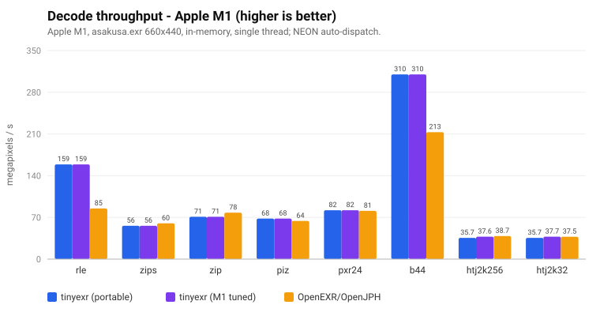

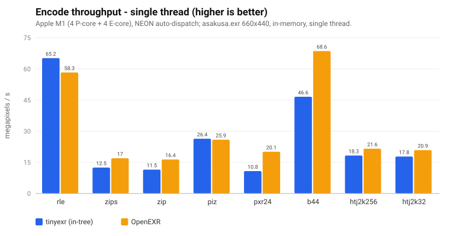

(`none` is off the chart on purpose, as on x64: **decode 2456 vs 859 MP/s**
(~2.9×), encode 1080 vs 423 (~2.6×) — it would flatten every other bar.)

Same shape as x64: TinyEXR wins the cheap codecs (**none ~2.9×**, **rle ~1.9×**,
**b44 dec ~1.5×**); OpenEXR leads the DEFLATE family / PIZ via its libdeflate
inflate and tuned PIZ. With **`LIBDEFLATE=1`** the deflate family comes to
near-parity.

**HTJ2K decode is now on-par on ARM.** The default portable NEON build reaches
35.7 MP/s on both profiles; the M1-tuned build (`EXR_JPH_HOST_NEON=1`) reaches
37.6 MP/s for htj2k256 versus OpenEXR/OpenJPH's 38.7, and 37.7 versus 37.5 for
htj2k32. The gain comes from the NEON two-quad cleanup path and vectorized
exponent derivation; the scalar entropy reader remains the correctness fallback.

### Multi-threaded (8 threads, in-tree)

| codec | tx enc | exr enc | tx dec | exr dec |
|-------|-------:|--------:|-------:|--------:|
| none  | 928  | 212  | **2391** | 160 |
| rle   | 276  | 127  | **684**  | 139 |
| zips  | 61.4 | 60.7 | 109  | 128 |
| zip   | 47.9 | 75.4 | 174  | **328** |
| piz   | 88.7 | 106  | 96.2 | 258 |
| pxr24 | 45.0 | 90.8 | 181  | **334** |
| b44   | 160  | 254  | **796** | 701 |
| htj2k256 | 18.2 | 35.7 | 28.4 | 50.3 |
| htj2k32  | 58.6 | 86.1 | 83.1 | 116 |

TinyEXR decode scales **~4×** to 8 threads (rle 163→684, zip 42→174, b44
318→796) and out-decodes OpenEXR on **none / rle / zips / b44**. OpenEXR's
libdeflate inflate scales harder, so it leads **zip / pxr24 / piz** decode at 8
threads in-tree. With **`LIBDEFLATE=1` at 8 threads** TinyEXR leads **zips
(272 vs 124)** and reaches parity on **zip (298 vs 321)** and **pxr24 (329 vs
324)** decode. (HTJ2K256 decode stays flat — at 256 lines/block `asakusa.exr` has
too few chunks to parallelize; HTJ2K32 scales to ~75 MP/s. The entropy reader is
scalar on ARM, while the wavelet, NLT, sign-magnitude, and cleanup staging paths
use NEON.)

The deep (scanline + tiled, encode + decode) and mipmap/ripmap paths are now
threaded. Still future work: thread the streaming APIs and sweep larger images
and channel counts.

---

*Charts: `doc/perf-decode.svg`, `perf-encode.svg`, `perf-libdeflate-decode.svg`,
`perf-libdeflate-htj2k-decode.png`, `perf-libdeflate-htj2k-encode.png`,
`perf-mt-scaling.svg`, `perf-mt-compare.svg`; ARM64/NEON:
`perf-arm-decode.svg`/`.png`, `perf-arm-encode.svg`/`.png`. Harness:
`benchmark/bench_compare.cpp` (`make bench-compare [THREADS=1] [LIBDEFLATE=1]`).*
